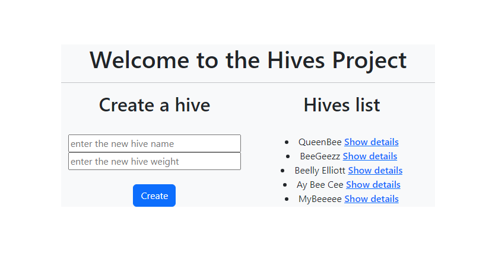
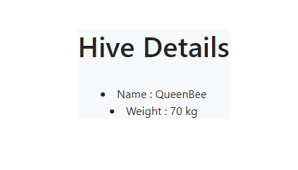

# README

***Welcome to the hives project***

**Prerequisites**
- Rails 7.1.3.3
- Ruby 3.3.0
- Vue 3 in Vite

**Project Goal**

For the bees lovers, this is an environnement to list all the hives you got !

This project is separated in 2 parts : back-end in Rails Api and a front-end in VueJS.
(Before installing the front-end, it's better to configure the back-end part in Rails : more details on the README.md)

**Before Rails Config**

1. Gemfile configuration
Go to your Gemfile, check if the rack-cors gem is uncommented. 
Go to config/initializers/cors.rb, check if this part is uncommented and change origins for '*' : 

`Rails.application.config.middleware.insert_before 0, Rack::Cors do
  allow do
    origins "*"

    resource "*",
      headers: :any,
      methods: [:get, :post, :put, :patch, :delete, :options, :head]
  end
end`

To handle Cross-Origin Resource Sharing (CORS), it's a security mechanism to add HTTP requests for a server ressource access located on another origin than the current site, in our case : the API part.

**Create VueJS Part**

1.In your terminal, go in the same location than your rails app, run the following commands : 

`npm run dev` to start the server

2.Go to [the URL](http://localhost:5173) and your BeeGeezz will appear. Now you can add your own hive with the form.

**Documentation**

- [Vue Router](https://router.vuejs.org/guide/)
- [Add Bootstrap](https://stackoverflow.com/questions/65547199/using-bootstrap-5-with-vue-3)
- [Styling](https://getbootstrap.com/docs/5.0/)
- [Video](https://www.youtube.com/watch?v=2Tm41U-dl24&ab_channel=Deanin)
